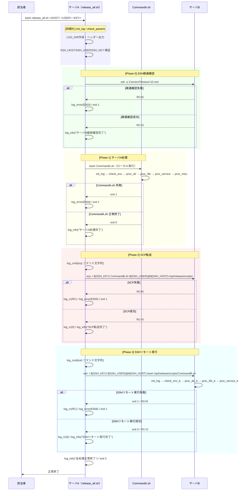

# 内部設計書（Design Document）

## 複数サーバ対応リリース作業自動化 - シェルスクリプト拡張

---

## 1. ドキュメント概要

| 項目 | 内容 |
|------|------|
| プロジェクト名 | リリース作業自動化（複数サーバ対応拡張） |
| ドキュメント種別 | 設計書（Design Document） |
| 対象 | `release_all.sh`、`CommandB.sh`、`deploy_multi.sh` |
| 参照資料 | requirements.md、外部設計書.md、内部設計書.md、ログ設計書.md、ディレクトリ定義書.md |

---

## Overview

### 2.1 目的

既存の単一サーバ向けリリース自動化スクリプト（`CommandA.sh`）を複数サーバ対応に拡張する。
サーバA上で実行中の既存25コマンド自動化を継承しつつ、サーバA処理完了後にサーバBへSCPで資材を転送し、SSH経由でリモート実行する一連のオーケストレーション機能を新設する。

### 2.2 拡張方針

- `CommandA.sh` の実装・動作は一切変更しない（後方互換性の保持）
- 新規3ファイルを追加して複数サーバ対応を実現する
- 既存の共通関数仕様（`log_info`・`log_error`・`log_cmd`・`log_rc`・`check_rc`・`check_str`）を全スクリプトで統一する
- SSH接続情報（`SSH_HOST`・`SSH_USER`・`SSH_KEY`）は実行引数から取得し、スクリプト内にハードコードしない

### 2.3 新規追加ファイル一覧

| ファイル名 | 種別 | 格納先 | 役割 |
|-----------|------|--------|------|
| `release_all.sh` | オーケストレーターシェル | `/opt/release/scripts/` | サーバA処理 → SCP転送 → SSHリモート実行を一括制御 |
| `CommandB.sh` | サーバB向けメインシェル | サーバAの `/opt/release/scripts/`（SCP転送元） | サーバBでリモート実行されるコマンド群 |
| `deploy_multi.sh` | 資材配置シェル | カレントディレクトリ | `CommandB.sh`・`release_all.sh` をサーバAの `/opt/release/scripts/` へ配置 |

---

## Architecture

### 3.1 システム全体像

```
担当者（Teraterm）
  │
  │ bash release_all.sh <SSH_HOST> <SSH_USER> <SSH_KEY>
  ▼
サーバA
  ├─ release_all.sh（オーケストレーター）
  │     │
  │     ├─ [1] パラメータチェック
  │     ├─ [2] SSH疎通確認（ssh -o ConnectTimeout=10）
  │     ├─ [3] CommandA.sh（ローカル実行）
  │     ├─ [4] SCP転送（CommandB.sh → サーバB）
  │     └─ [5] SSH リモート実行（CommandB.sh on サーバB）
  │
  ├─ CommandA.sh（既存・変更なし）
  │     └─ 25コマンドを実行（ログ: /var/log/release/）
  │
  └─ CommandB.sh（新規・SCP転送元）
        └─ サーバBでリモート実行される

サーバB
  └─ /opt/release/scripts/CommandB.sh
        └─ サーバB固有コマンド群を実行（ログ: /var/log/release/）
```

### 3.2 スクリプト間依存関係

```
deploy_multi.sh
  ├─ CommandB.sh を /opt/release/scripts/ へ配置
  └─ release_all.sh を /opt/release/scripts/ へ配置

release_all.sh
  ├─ 依存: CommandA.sh（サーバA上で実行）
  ├─ 依存: CommandB.sh（SCPでサーバBへ転送）
  └─ 依存: SSH/SCP（OpenSSH クライアント）
```

---

## Components and Interfaces

### 4.1 release_all.sh（オーケストレーター）

#### 4.1.1 全体構造

```bash
#!/bin/bash
# ============================================================
# release_all.sh - 複数サーバ対応オーケストレーターシェル
# 使用方法: bash release_all.sh <SSH_HOST> <SSH_USER> <SSH_KEY>
# ============================================================

set -u

# --- 定数定義 ---
readonly LOG_DIR="/var/log/release"
readonly TIMESTAMP=$(date +%Y%m%d%H%M%S)
readonly LOG_FILE="${LOG_DIR}/release_all_${TIMESTAMP}.log"
readonly DETAIL_LOG="${LOG_DIR}/release_all_detail_${TIMESTAMP}.log"
readonly SCRIPT_DIR="/opt/release/scripts"
readonly CMD_B_SH="${SCRIPT_DIR}/CommandB.sh"
readonly CMD_B_REMOTE="/opt/release/scripts/CommandB.sh"

# --- 引数（実行時に取得）---
SSH_HOST="$1"
SSH_USER="$2"
SSH_KEY="$3"

# --- 共通関数定義 ---
log_info()   { ... }
log_error()  { ... }
log_cmd()    { ... }
log_rc()     { ... }
check_rc()   { ... }
check_str()  { ... }

# --- メイン処理 ---
main() {
    init_log                 # ログ初期化
    check_params             # パラメータ検証
    check_ssh_connection     # SSH疎通確認
    run_server_a             # サーバA処理
    scp_to_server_b          # SCP転送
    run_server_b             # SSHリモート実行
    log_info "全処理正常終了"
    exit 0
}

main "$@"
```

#### 4.1.2 定数定義

| 定数名 | 値 | 説明 |
|--------|----|------|
| `LOG_DIR` | `/var/log/release` | ログ出力ディレクトリ |
| `TIMESTAMP` | `$(date +%Y%m%d%H%M%S)` | 実行開始日時（スクリプト起動時に1回取得） |
| `LOG_FILE` | `/var/log/release/release_all_YYYYMMDDHHMMSS.log` | シェル実行ログ |
| `DETAIL_LOG` | `/var/log/release/release_all_detail_YYYYMMDDHHMMSS.log` | 詳細ログ |
| `SCRIPT_DIR` | `/opt/release/scripts` | スクリプト配置ディレクトリ |
| `CMD_B_SH` | `${SCRIPT_DIR}/CommandB.sh` | SCP転送元ファイルパス（サーバA上） |
| `CMD_B_REMOTE` | `/opt/release/scripts/CommandB.sh` | SCP転送先・SSH実行パス（サーバB上） |

#### 4.1.3 実行時引数

| 引数 | 変数名 | 説明 |
|------|--------|------|
| `$1` | `SSH_HOST` | サーバBのホスト名またはIPアドレス |
| `$2` | `SSH_USER` | サーバBへのSSH接続ユーザー名 |
| `$3` | `SSH_KEY` | 公開鍵認証用秘密鍵ファイルパス |

#### 4.1.4 共通関数設計（CommandA.sh と同一仕様）

| 関数名 | 役割 | 引数 | 出力先 |
|--------|------|------|--------|
| `log_info()` | INFOログ出力 | `$1`：メッセージ | `LOG_FILE` + 標準出力 |
| `log_error()` | ERRORログ出力 | `$1`：エラーメッセージ | `LOG_FILE` + 標準エラー出力 |
| `log_cmd()` | コマンドログ出力 | `$1`：実行コマンド文字列 | `DETAIL_LOG` |
| `log_rc()` | ReturnCodeログ出力 | `$1`：ReturnCode値 | `DETAIL_LOG` |
| `check_rc()` | ReturnCodeチェック | `$1`：実際のRC、`$2`：期待RC、`$3`：エラーコード、`$4`：エラーメッセージ | `LOG_FILE` / `DETAIL_LOG` |
| `check_str()` | 出力文字列チェック | `$1`：出力、`$2`：キーワード、`$3`：モード、`$4`：エラーコード、`$5`：エラーメッセージ | `LOG_FILE` |

#### 4.1.5 各処理関数の詳細設計

##### init_log（ログ初期化）

| ステップ | 処理内容 |
|---------|---------|
| 1 | `LOG_DIR` が存在しない場合、`mkdir -p` で作成 |
| 2 | `LOG_FILE`・`DETAIL_LOG` にヘッダー（スクリプト名・実行開始日時）を出力 |
| 3 | 実行対象サーバ（`SSH_HOST`）情報を `log_info()` でシェル実行ログに出力 |

##### check_params（パラメータ検証）

| ステップ | 処理内容 | エラー処理 |
|---------|---------|-----------|
| 1 | `SSH_HOST` が空文字でないことを確認 | 空の場合: `log_error()` でパラメータ名を出力し `exit 1` |
| 2 | `SSH_USER` が空文字でないことを確認 | 空の場合: 同上 |
| 3 | `SSH_KEY` が空文字でないことを確認 | 空の場合: 同上 |
| 4 | `SSH_KEY` で指定された秘密鍵ファイルが存在することを確認 | 不存在の場合: 同上 |

##### check_ssh_connection（SSH疎通確認）

| ステップ | 処理内容 | 実行コマンド | エラー処理 |
|---------|---------|------------|-----------|
| 1 | サーバBへの疎通確認 | `ssh -o ConnectTimeout=10 -i ${SSH_KEY} ${SSH_USER}@${SSH_HOST} exit 2>&1` | RC≠0 → `log_error()` でホスト名付きエラー出力・`exit 1` |
| 2 | 疎通確認成功時 | ― | `log_info()` で「サーバB接続確認完了」を出力 |

##### run_server_a（サーバA処理）

| ステップ | 処理内容 | 実行コマンド | エラー処理 |
|---------|---------|------------|-----------|
| 1 | 処理開始ログ出力 | ― | ― |
| 2 | CommandA.sh をローカル実行 | `bash ${SCRIPT_DIR}/CommandA.sh` | RC≠0 → `log_error()` でエラーコード・詳細を出力・`exit 1` |
| 3 | 処理完了ログ出力 | ― | ― |

##### scp_to_server_b（SCP転送）

| ステップ | 処理内容 | 実行コマンド | エラー処理 |
|---------|---------|------------|-----------|
| 1 | 転送開始ログ出力 | ― | ― |
| 2 | コマンドをDETAIL_LOGへ記録 | `log_cmd "scp -i ${SSH_KEY} ${CMD_B_SH} ${SSH_USER}@${SSH_HOST}:${CMD_B_REMOTE}"` | ― |
| 3 | SCPでCommandB.shを転送 | `scp -i ${SSH_KEY} ${CMD_B_SH} ${SSH_USER}@${SSH_HOST}:${CMD_B_REMOTE} 2>&1` | RC≠0 → `log_error()` で転送元・転送先を含むエラー出力・`exit 1` |
| 4 | ReturnCodeをDETAIL_LOGへ記録 | `log_rc "${rc}"` | ― |
| 5 | 転送完了ログ出力 | `log_info()` | ― |

##### run_server_b（SSHリモート実行）

| ステップ | 処理内容 | 実行コマンド | エラー処理 |
|---------|---------|------------|-----------|
| 1 | リモート実行開始ログ出力 | ― | ― |
| 2 | コマンドをDETAIL_LOGへ記録 | `log_cmd "ssh -i ${SSH_KEY} ${SSH_USER}@${SSH_HOST} bash ${CMD_B_REMOTE}"` | ― |
| 3 | SSH経由でCommandB.shをリモート実行 | `ssh -i ${SSH_KEY} ${SSH_USER}@${SSH_HOST} bash ${CMD_B_REMOTE} 2>&1` | RC≠0 → `log_error()` でエラーコード・実行コマンド・RC値を出力・`exit 1` |
| 4 | ReturnCodeをDETAIL_LOGへ記録 | `log_rc "${rc}"` | ― |
| 5 | リモート実行完了ログ出力 | `log_info()` | ― |

---

### 4.2 CommandB.sh（サーバB向けメインシェル）

#### 4.2.1 全体構造

```bash
#!/bin/bash
# ============================================================
# CommandB.sh - サーバB向けリリース作業自動化シェルスクリプト
# SSH経由でリモート実行される
# ============================================================

set -u

# --- 定数定義 ---
readonly LOG_DIR="/var/log/release"
readonly TIMESTAMP=$(date +%Y%m%d%H%M%S)
readonly LOG_FILE="${LOG_DIR}/CommandB_${TIMESTAMP}.log"
readonly DETAIL_LOG="${LOG_DIR}/CommandB_detail_${TIMESTAMP}.log"
readonly WORK_DIR_B="/tmp/testdir_b"
readonly DATA_FILE_B="${WORK_DIR_B}/data_b.txt"
readonly SERVICE_NAME_B="httpd"    # サーバB固有のサービス名（例）

# --- 共通関数定義（CommandA.sh と同一仕様） ---
log_info()   { ... }
log_error()  { ... }
log_cmd()    { ... }
log_rc()     { ... }
check_rc()   { ... }
check_str()  { ... }

# --- メイン処理 ---
main() {
    init_log
    log_info "CommandB.sh 処理開始"
    check_env_b
    proc_dir_b
    proc_file_b
    proc_service_b
    log_info "CommandB.sh 処理正常終了"
    exit 0
}

main
```

#### 4.2.2 定数定義

| 定数名 | 値 | 説明 |
|--------|----|------|
| `LOG_DIR` | `/var/log/release` | ログ出力ディレクトリ（サーバBのローカルパス） |
| `TIMESTAMP` | `$(date +%Y%m%d%H%M%S)` | 実行開始日時 |
| `LOG_FILE` | `/var/log/release/CommandB_YYYYMMDDHHMMSS.log` | シェル実行ログ |
| `DETAIL_LOG` | `/var/log/release/CommandB_detail_YYYYMMDDHHMMSS.log` | 詳細ログ |
| `WORK_DIR_B` | `/tmp/testdir_b` | サーバB上の作業ディレクトリ |
| `DATA_FILE_B` | `/tmp/testdir_b/data_b.txt` | サーバB用データファイル |
| `SERVICE_NAME_B` | `httpd`（例） | サーバB固有の操作対象サービス名 |

#### 4.2.3 各処理関数の概要

| 関数名 | 処理内容 |
|--------|---------|
| `init_log()` | ログディレクトリ作成・ログヘッダー出力（`CommandA.sh` と同一仕様） |
| `check_env_b()` | `LOG_DIR` 書き込み権限確認・`systemctl` コマンド存在確認 |
| `proc_dir_b()` | サーバB上でのディレクトリ作成・削除操作 |
| `proc_file_b()` | サーバB上でのファイル作成・確認・削除操作 |
| `proc_service_b()` | サーバB固有のサービス起動・停止・状態確認 |

> **注意：** `CommandB.sh` の具体的なコマンド内容はサーバB固有の手順書に基づき決定する。
> 本設計書では共通関数仕様・ログ仕様・エラーハンドリングパターンのみ規定し、個別コマンドは別途手順書で管理する。

---

### 4.3 deploy_multi.sh（複数サーバ向け資材配置シェル）

#### 4.3.1 全体構造

```bash
#!/bin/bash
# ============================================================
# deploy_multi.sh - 複数サーバ対応資材配置シェル
# CommandB.sh と release_all.sh を /opt/release/scripts/ へ配置
# ============================================================

set -u

# --- 定数定義 ---
SCRIPT_DIR="/opt/release/scripts"
SRC_CMD_B="./CommandB.sh"
SRC_RELEASE_ALL="./release_all.sh"

# --- メイン処理 ---
main() {
    check_src_files    # 配置元ファイル存在確認
    make_dir           # 配置先ディレクトリ作成
    copy_files         # ファイルコピー
    set_permissions    # 実行権限付与
    echo "全資材の配置完了: ${SCRIPT_DIR}"
    exit 0
}

main
```

#### 4.3.2 定数定義

| 定数名 | 値 | 説明 |
|--------|----|------|
| `SCRIPT_DIR` | `/opt/release/scripts` | 配置先ディレクトリ |
| `SRC_CMD_B` | `./CommandB.sh` | 配置元 CommandB.sh（カレントディレクトリ） |
| `SRC_RELEASE_ALL` | `./release_all.sh` | 配置元 release_all.sh（カレントディレクトリ） |

#### 4.3.3 各処理詳細

| 関数名 | 処理内容 | 実行コマンド | エラー処理 |
|--------|---------|------------|-----------|
| `check_src_files` | `CommandB.sh` の存在確認 | `[ -f ${SRC_CMD_B} ]` | 不存在の場合: エラーメッセージ出力・`exit 1` |
| | `release_all.sh` の存在確認 | `[ -f ${SRC_RELEASE_ALL} ]` | 同上 |
| `make_dir` | 配置先ディレクトリ作成 | `[ -d ${SCRIPT_DIR} ] \|\| mkdir -p ${SCRIPT_DIR}` | `mkdir` 失敗の場合: エラーメッセージ出力・`exit 1` |
| `copy_files` | CommandB.sh コピー | `cp ${SRC_CMD_B} ${SCRIPT_DIR}/CommandB.sh` | RC≠0の場合: エラーメッセージ出力・`exit 1` |
| | release_all.sh コピー | `cp ${SRC_RELEASE_ALL} ${SCRIPT_DIR}/release_all.sh` | 同上 |
| `set_permissions` | CommandB.sh に実行権限付与 | `chmod 755 ${SCRIPT_DIR}/CommandB.sh` | RC≠0の場合: エラーメッセージ出力・`exit 1` |
| | release_all.sh に実行権限付与 | `chmod 755 ${SCRIPT_DIR}/release_all.sh` | 同上 |

---

## Data Models

### 5.1 ディレクトリ構成（拡張後）

#### サーバA（`/opt/release/scripts/`）

```
/
├── opt/
│   └── release/
│       └── scripts/
│           ├── CommandA.sh           # 既存（変更なし）
│           ├── CommandB.sh           # 新規追加（SCP転送元）
│           └── release_all.sh        # 新規追加（オーケストレーター）
└── var/
    └── log/
        └── release/
            ├── CommandA_YYYYMMDDHHMMSS.log
            ├── CommandA_detail_YYYYMMDDHHMMSS.log
            ├── release_all_YYYYMMDDHHMMSS.log         # 新規
            └── release_all_detail_YYYYMMDDHHMMSS.log  # 新規
```

#### サーバB（`/opt/release/scripts/`）

```
/
├── opt/
│   └── release/
│       └── scripts/
│           └── CommandB.sh           # SCPで転送されたファイル
└── var/
    └── log/
        └── release/
            ├── CommandB_YYYYMMDDHHMMSS.log             # CommandB.sh実行時に生成
            └── CommandB_detail_YYYYMMDDHHMMSS.log      # CommandB.sh実行時に生成
```

### 5.2 ログファイル命名規則（拡張後）

> ログ設計書.md「3. ログファイル命名規則」に準拠。

| シェル名 | シェル実行ログ | 詳細ログ |
|---------|--------------|---------|
| `CommandA.sh` | `CommandA_YYYYMMDDHHMMSS.log` | `CommandA_detail_YYYYMMDDHHMMSS.log` |
| `release_all.sh` | `release_all_YYYYMMDDHHMMSS.log` | `release_all_detail_YYYYMMDDHHMMSS.log` |
| `CommandB.sh` | `CommandB_YYYYMMDDHHMMSS.log` | `CommandB_detail_YYYYMMDDHHMMSS.log` |

### 5.3 ファイル権限定義

| 対象ファイル/ディレクトリ | 権限値 | 備考 |
|------------------------|--------|------|
| `release_all.sh` | `755` | `deploy_multi.sh` が付与 |
| `CommandB.sh` | `755` | `deploy_multi.sh` が付与 |
| `deploy_multi.sh` | `755` | 手動で付与 |
| `/var/log/release/` | `755` | `init_log` 実行時に自動作成 |
| ログファイル（`*.log`） | `644` | `tee` / リダイレクトで生成される標準権限 |

---

## Correctness Properties

*プロパティとは、システムのすべての有効な実行において成立すべき特性または動作のことです。プロパティは人間が読める仕様と機械で検証可能な正確性保証の橋渡しをします。*

---

### Property 1: ログ出力フォーマット準拠

*任意の* 文字列メッセージに対して `log_info()`・`log_error()`・`log_cmd()`・`log_rc()` を呼び出したとき、出力される各行は必ず `[YYYY-MM-DD HH:MM:SS] [LEVEL] メッセージ` のフォーマットに適合しなければならない。

**Validates: Requirements 5.2, 5.4, 8.2**

---

### Property 2: 必須パラメータ未設定時の拒否

*任意の* `SSH_HOST`・`SSH_USER`・`SSH_KEY` の値の組み合わせにおいて、いずれか1つ以上が空文字または未設定である場合、`release_all.sh` は必ず不足パラメータ名を含むエラーメッセージを出力し `exit 1` で終了しなければならない。

**Validates: Requirements 10.2**

---

## Error Handling

### 7.1 エラーコード体系（拡張分）

> 既存の `CommandA.sh` エラーコード（E101〜E402）は変更しない。拡張分は E5xx 番台を使用する。

| エラーコード | 発生箇所 | エラー内容 | 対処 |
|------------|---------|-----------|------|
| `E501` | `release_all.sh` | パラメータ未設定（SSH_HOST/SSH_USER/SSH_KEY） | エラーログ出力・`exit 1` |
| `E502` | `release_all.sh` | 秘密鍵ファイル不存在 | エラーログ出力・`exit 1` |
| `E503` | `release_all.sh` | サーバB疎通確認失敗 | エラーログ出力・`exit 1` |
| `E504` | `release_all.sh` | CommandA.sh 実行失敗 | エラーログ出力・`exit 1` |
| `E505` | `release_all.sh` | SCP転送失敗 | エラーログ出力（転送元・転送先含む）・`exit 1` |
| `E506` | `release_all.sh` | SSHリモート実行失敗 | エラーログ出力（コマンド・RC値含む）・`exit 1` |
| `E601` | `CommandB.sh` | ログディレクトリ作成失敗 | エラーログ出力・`exit 1` |
| `E602` | `CommandB.sh` | コマンド実行失敗（RC≠0） | エラーログ出力・`exit 1` |

### 7.2 ReturnCode 取り扱い規則

SSH/SCP コマンドの `$?` は実行直後に変数 `rc` へ退避してから `check_rc()` に渡す。

```bash
# 良い例
scp -i "${SSH_KEY}" "${CMD_B_SH}" "${SSH_USER}@${SSH_HOST}:${CMD_B_REMOTE}" 2>&1
rc=$?
log_rc "${rc}"
check_rc "${rc}" 0 "E505" "SCP転送失敗: ${CMD_B_SH} -> ${SSH_USER}@${SSH_HOST}:${CMD_B_REMOTE}"
```

### 7.3 エラー発生時の動作保証

| 処理フェーズ | エラー発生時の動作 |
|------------|----------------|
| パラメータチェック失敗 | SCP/SSH 実行前に中断・`exit 1` |
| 疎通確認失敗 | SCP/SSH 実行前に中断・`exit 1` |
| CommandA.sh 失敗 | SCP/SSH 実行前に中断・`exit 1` |
| SCP転送失敗 | SSH実行前に中断・`exit 1` |
| SSHリモート実行失敗 | 即時中断・`exit 1` |

---

## Testing Strategy

### 8.1 テスト全体方針

| テスト種別 | 目的 | 対象 |
|-----------|------|------|
| スモークテスト | スクリプトの存在・権限・基本起動確認 | 全3ファイル |
| ユニットテスト（例示ベース） | 各関数の正常系・異常系動作確認 | 共通関数・各処理関数 |
| プロパティベーステスト | 普遍的な性質の検証（全入力で成立） | ログ出力・パラメータチェック |
| 結合テスト | SSH/SCP モックを使用した処理フロー確認 | `release_all.sh` 全体フロー |

### 8.2 スモークテスト

| テスト項目 | 確認内容 |
|-----------|---------|
| `release_all.sh` ファイル存在確認 | `/opt/release/scripts/release_all.sh` が存在し権限が `755` であること |
| `CommandB.sh` ファイル存在確認 | `/opt/release/scripts/CommandB.sh` が存在し権限が `755` であること |
| `CommandA.sh` 変更なし確認 | 既存 `CommandA.sh` の内容が変更されていないこと |

### 8.3 ユニットテスト（例示ベース）

#### 正常系テスト例

| テスト項目 | テスト内容 | 確認事項 |
|-----------|---------|---------|
| パラメータ検証（正常） | 3引数すべて有効値で起動 | エラーなし・処理継続 |
| SCP転送（正常） | SSH/SCPモックで成功を返却 | `log_info` に転送完了メッセージが記録される |
| SSHリモート実行（正常） | SSH モックで成功を返却 | `log_info` に完了メッセージが記録される |
| deploy_multi.sh（正常） | 全ファイルが存在する状態で実行 | 配置先に `755` で配置される |

#### 異常系テスト例（エッジケース）

| テスト項目 | テスト内容 | 確認事項 |
|-----------|---------|---------|
| `SSH_HOST` 空文字 | 引数1を空で起動 | `E501` エラー出力・`exit 1` |
| `SSH_KEY` ファイル不存在 | 存在しないパスを指定 | `E502` エラー出力・`exit 1` |
| 疎通確認失敗 | `ssh -o ConnectTimeout=10` がRC≠0 | `E503` エラー出力・`exit 1`・SCP不実行 |
| `CommandA.sh` 失敗 | モックCommandA.shがexit 1を返却 | `E504` エラー出力・`exit 1`・SCP不実行 |
| SCP転送失敗 | SCPモックがRC≠0 | `E505` エラー出力・`exit 1`・SSH不実行 |
| SSHリモート実行失敗 | SSHモックがRC≠0 | `E506` エラー出力・`exit 1` |
| 配置元ファイル不存在（deploy） | `CommandB.sh` を置かずに実行 | エラーメッセージ出力・`exit 1` |

### 8.4 プロパティベーステスト（PBT）

プロパティベーステストには **bash 向けの PBT フレームワーク（bats + 自作ジェネレーター）** または **Python の Hypothesis** を使用し、最低100回のイテレーションを実施する。

#### プロパティ 1: ログ出力フォーマット準拠

```
テスト名: test_log_format_property
タグ: Feature: multi-server-release-automation, Property 1: ログ出力フォーマット準拠
対象関数: log_info / log_error / log_cmd / log_rc（release_all.sh・CommandB.sh 両方）
ジェネレーター: ランダムな任意文字列（ASCII・マルチバイト・特殊文字を含む）
検証内容: 出力各行が正規表現 \[\d{4}-\d{2}-\d{2} \d{2}:\d{2}:\d{2}\] \[(INFO|ERROR|CMD|RC)\] にマッチすること
イテレーション: 100回以上
```

#### プロパティ 2: 必須パラメータ未設定時の拒否

```
テスト名: test_param_validation_property
タグ: Feature: multi-server-release-automation, Property 2: 必須パラメータ未設定時の拒否
対象: release_all.sh のパラメータチェック処理
ジェネレーター: SSH_HOST・SSH_USER・SSH_KEY の値の組み合わせ（各値: 有効な文字列 or 空文字）
               ただし1つ以上が空文字である組み合わせのみ生成
検証内容: release_all.sh が必ず exit 1 で終了すること、かつシェル実行ログに空だったパラメータ名が含まれること
イテレーション: 100回以上
```

### 8.5 結合テスト

SSH/SCP モックスクリプトを用意し、`release_all.sh` の完全なフローをエンドツーエンドで確認する。

| テスト項目 | 確認内容 |
|-----------|---------|
| 正常フロー | サーバA→SCP→SSH が順序通り実行され、全フェーズのログが記録される |
| サーバA失敗中断 | CommandA.sh 失敗後に SCP・SSH が実行されないこと |
| SCP失敗中断 | SCP失敗後に SSH が実行されないこと |
| ログファイル生成確認 | `release_all_YYYYMMDDHHMMSS.log`・`release_all_detail_YYYYMMDDHHMMSS.log` が正しく生成されること |

---

## 9. SSH/SCP 連携フロー（シーケンス図）



---

## 10. 既存 CommandA.sh との整合性

| 観点 | 方針 |
|------|------|
| ファイル内容 | `CommandA.sh` は一切変更しない |
| 実行方式 | `release_all.sh` から `bash ${SCRIPT_DIR}/CommandA.sh` としてローカル起動する |
| 共通関数仕様 | `log_info` / `log_error` / `log_cmd` / `log_rc` / `check_rc` / `check_str` の引数・動作は `CommandA.sh` の実装と完全一致させる |
| エラーコード | `CommandA.sh` の E1xx〜E4xx を維持し、拡張分は E5xx〜E6xx を使用する |
| ログディレクトリ | `/var/log/release/` を共有する（ファイル名でスクリプトを識別） |
| ログフォーマット | ログ設計書.md「5. ログ出力フォーマット」の共通ルールを全スクリプトで遵守する |

---

## 11. 制約・前提条件

| # | 区分 | 内容 |
|---|------|------|
| 1 | 前提 | サーバAからサーバBへのSSH公開鍵認証が事前に設定済みであること |
| 2 | 前提 | サーバBに `/opt/release/scripts/` ディレクトリの作成権限があること |
| 3 | 前提 | サーバBに `/var/log/release/` ディレクトリの作成権限があること |
| 4 | 前提 | サーバBに `bash` コマンドが存在すること |
| 5 | 制約 | `SSH_HOST`・`SSH_USER`・`SSH_KEY` はシェルスクリプト内にハードコードしない |
| 6 | 制約 | パスワード・パスフレーズはログに記録しない |
| 7 | 制約 | `CommandA.sh` の実装は変更しない |
| 8 | スコープ外 | サーバBのSSH公開鍵認証セットアップ手順は本プロジェクトのスコープ外とする |
