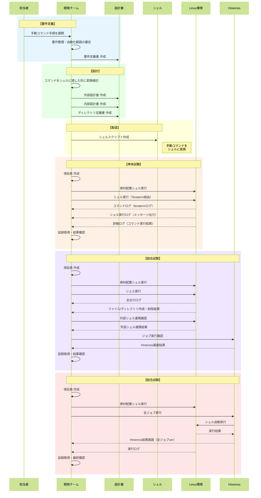

# リリース作業自動化 シーケンス図

## 概要
手動のLinux手順コマンドをシェル化し、リリース作業を自動化する全体フロー

## シーケンス図

## 自動化の目的
| # | 目的 | 説明 |
|---|------|------|
| ① | 作業時間の短縮 | 手動で行っていた作業をシェルで一括実行 |
| ② | 作業の手間削減 | 人が行う操作手順を最小化 |
| ③ | ミス削減 | 人為的な作業ミスをシェル化により防止 |

## 工程と成果物一覧
| 工程 | 成果物 |
|------|--------|
| 要件定義 | 要件定義書 |
| 設計 | 外部設計書、内部設計書、ディレクトリ定義書 |
| 製造 | シェルスクリプト |
| 単体試験 | 項目表、資材配置シェル |
| 結合試験 | 項目表、資材配置シェル |
| 総合試験 | 項目表、資材配置シェル |
