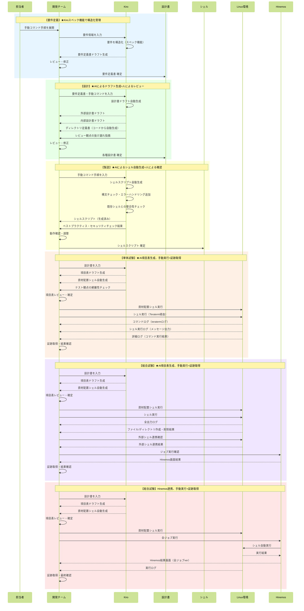

# リリース作業自動化 シーケンス図（Kiro導入後）

## 概要
手動のLinux手順コマンドをシェル化し、リリース作業を自動化するフロー。
Kiro導入により、設計・製造・試験準備工程でAI支援が加わる。

## シーケンス図

## Kiro導入による変化まとめ

| 工程 | 導入前 | 導入後 | 削減効果 |
|------|--------|--------|----------|
| 要件定義 | 手動作成 | AI支援（スペック機能） | 約20-30%短縮 |
| 設計 | 手動作成 | AI生成+レビュー | 約40-50%短縮 |
| 製造 | 手動変換 | AI自動生成+確認 | 約50-60%短縮 |
| 単体試験準備 | 手動作成 | AI生成+確認 | 約30-40%短縮 |
| 結合試験準備 | 手動作成 | AI生成+確認 | 約30-40%短縮 |
| 総合試験準備 | 手動作成 | AI生成+確認 | 約20-30%短縮 |

## 注意事項
- 証跡取得は実環境での実行が必要なため、工数削減は限定的
- 人によるレビュー・確認は必須（AIの出力を無条件に信頼しない）
- ★マークがKiro導入による変化箇所
